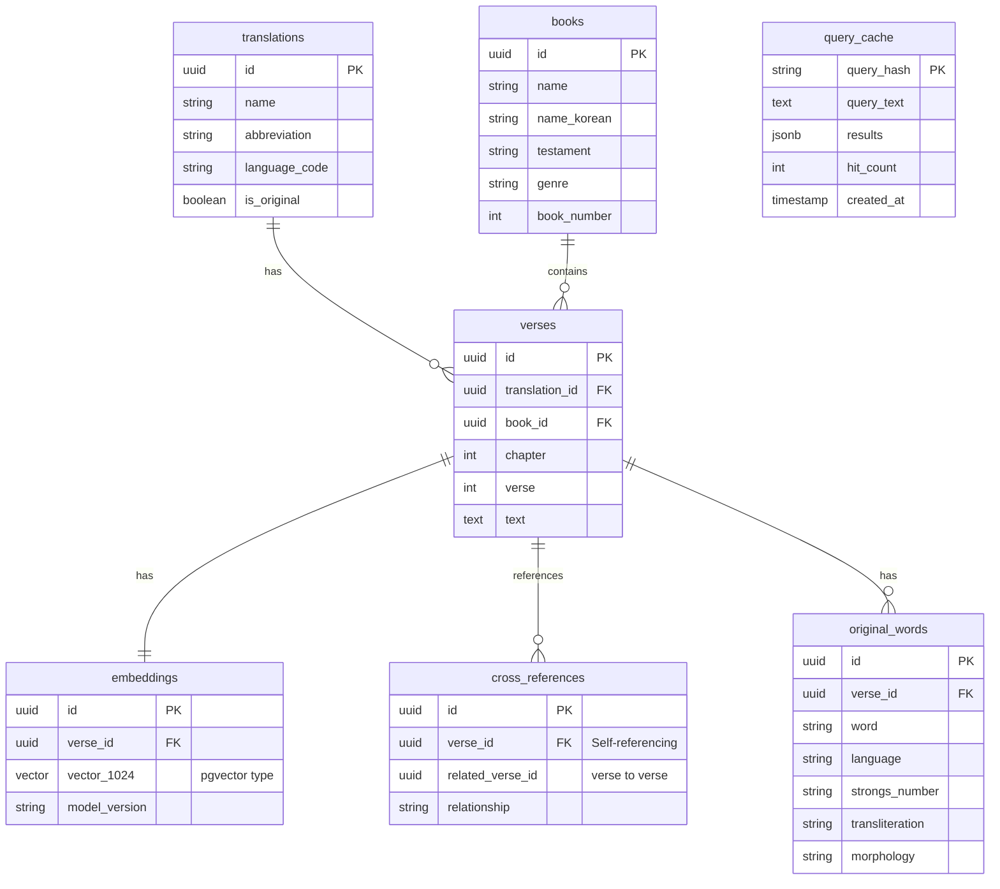

# Bible RAG - Database Documentation

Complete database schema, data models, and query reference for the Bible RAG system.

## Table of Contents

- [Overview](#overview)
- [Database Technology](#database-technology)
- [Schema Design](#schema-design)
- [Table Specifications](#table-specifications)
- [Relationships & Foreign Keys](#relationships--foreign-keys)
- [Indexes & Performance](#indexes--performance)
- [pgvector Extension](#pgvector-extension)
- [Sample Queries](#sample-queries)
- [Data Migration](#data-migration)
- [Backup & Restore](#backup--restore)

---

## Overview

### Database Purpose

The Bible RAG database serves as the central data store for:
- Bible text across multiple translations (English, Korean, original languages)
- Vector embeddings for semantic search (1024-dimensional)
- Cross-references and related verses
- Original language word data (Greek, Hebrew, Aramaic)
- Query cache for performance optimization

### Key Requirements

1. **Multilingual Support**: Store text in multiple languages with proper Unicode handling
2. **Vector Search**: Efficient similarity search across 31,000+ verse embeddings
3. **Relational Integrity**: Maintain relationships between verses, books, translations
4. **Performance**: Sub-second query response times
5. **Scalability**: Support for 100K+ verses across multiple translations

---

## Database Technology

### PostgreSQL 16

**Why PostgreSQL?**
- Mature, open-source RDBMS
- Excellent JSON support (for flexible metadata)
- Strong ACID compliance
- Advanced indexing capabilities
- Active community and ecosystem

### pgvector Extension

**Why pgvector?**
- Native vector similarity search in PostgreSQL
- Efficient indexing (ivfflat, hnsw)
- Supports multiple distance metrics (L2, cosine, inner product)
- No need for separate vector database
- Easy integration with existing SQL queries

**Installation:**
```sql
CREATE EXTENSION IF NOT EXISTS vector;
```

---

## Schema Design

### Entity-Relationship Diagram (ERD)



### Design Principles

1. **Normalization**: 3NF (Third Normal Form) to minimize redundancy
2. **UUID Primary Keys**: Globally unique, distributed-system friendly
3. **Foreign Key Constraints**: Enforce referential integrity
4. **Indexes on FK columns**: Fast JOIN operations
5. **JSONB for flexible data**: Query cache results, future metadata

---

## Table Specifications

### translations

Stores metadata for Bible translations.

```sql
CREATE TABLE translations (
    id UUID PRIMARY KEY DEFAULT uuid_generate_v4(),
    name TEXT NOT NULL,                          -- "New International Version"
    abbreviation TEXT NOT NULL UNIQUE,           -- "NIV"
    language_code TEXT NOT NULL,                 -- "en", "ko", "he", "gr"
    description TEXT,                             -- Translation details
    is_original_language BOOLEAN DEFAULT false,   -- true for Hebrew/Greek
    created_at TIMESTAMP DEFAULT NOW(),
    updated_at TIMESTAMP DEFAULT NOW()
);

-- Indexes
CREATE INDEX idx_translations_language ON translations(language_code);
CREATE INDEX idx_translations_abbrev ON translations(abbreviation);

-- Sample data
INSERT INTO translations (name, abbreviation, language_code, is_original_language) VALUES
('New International Version', 'NIV', 'en', false),
('English Standard Version', 'ESV', 'en', false),
('개역개정', 'RKV', 'ko', false),
('개역한글', 'KRV', 'ko', false),
('SBL Greek New Testament', 'SBLGNT', 'gr', true),
('Westminster Leningrad Codex', 'WLC', 'he', true);
```

**Constraints:**
- `abbreviation` must be unique
- `language_code` uses ISO 639-1 codes (2-letter)

---

### books

Stores Bible book metadata.

```sql
CREATE TABLE books (
    id UUID PRIMARY KEY DEFAULT uuid_generate_v4(),
    name TEXT NOT NULL,                    -- "Genesis"
    name_korean TEXT,                      -- "창세기"
    name_original TEXT,                    -- "Βραχής" (Greek), "בְּרֵאשִׁית" (Hebrew)
    abbreviation TEXT NOT NULL,            -- "Gen"
    testament TEXT NOT NULL CHECK (testament IN ('OT', 'NT')),
    genre TEXT,                            -- "law", "history", "gospel", "epistle", etc.
    book_number INTEGER NOT NULL,          -- 1-66 (canonical order)
    total_chapters INTEGER NOT NULL,       -- Total chapters in book
    created_at TIMESTAMP DEFAULT NOW(),
    UNIQUE(book_number)
);

-- Indexes
CREATE INDEX idx_books_testament ON books(testament);
CREATE INDEX idx_books_genre ON books(genre);
CREATE INDEX idx_books_number ON books(book_number);

-- Sample data
INSERT INTO books (name, name_korean, abbreviation, testament, genre, book_number, total_chapters) VALUES
('Genesis', '창세기', 'Gen', 'OT', 'law', 1, 50),
('Exodus', '출애굽기', 'Exod', 'OT', 'law', 2, 40),
('Matthew', '마태복음', 'Matt', 'NT', 'gospel', 40, 28),
('John', '요한복음', 'John', 'NT', 'gospel', 43, 21),
('Romans', '로마서', 'Rom', 'NT', 'epistle', 45, 16);
```

**Genres:**
- OT: `law`, `history`, `wisdom`, `prophecy`, `poetry`
- NT: `gospel`, `history`, `epistle`, `prophecy`

---

### verses

Stores actual Bible verse text for each translation.

```sql
CREATE TABLE verses (
    id UUID PRIMARY KEY DEFAULT uuid_generate_v4(),
    translation_id UUID NOT NULL REFERENCES translations(id) ON DELETE CASCADE,
    book_id UUID NOT NULL REFERENCES books(id) ON DELETE CASCADE,
    chapter INTEGER NOT NULL CHECK (chapter >= 1),
    verse INTEGER NOT NULL CHECK (verse >= 1),
    text TEXT NOT NULL,
    created_at TIMESTAMP DEFAULT NOW(),
    updated_at TIMESTAMP DEFAULT NOW(),
    UNIQUE(translation_id, book_id, chapter, verse)
);

-- Indexes
CREATE INDEX idx_verses_translation ON verses(translation_id);
CREATE INDEX idx_verses_book ON verses(book_id);
CREATE INDEX idx_verses_book_chapter ON verses(book_id, chapter);
CREATE INDEX idx_verses_text_search ON verses USING gin(to_tsvector('english', text));

-- Sample data
INSERT INTO verses (translation_id, book_id, chapter, verse, text) VALUES
(
    (SELECT id FROM translations WHERE abbreviation = 'NIV'),
    (SELECT id FROM books WHERE abbreviation = 'John'),
    3,
    16,
    'For God so loved the world that he gave his one and only Son, that whoever believes in him shall not perish but have eternal life.'
),
(
    (SELECT id FROM translations WHERE abbreviation = 'RKV'),
    (SELECT id FROM books WHERE abbreviation = 'John'),
    3,
    16,
    '하나님이 세상을 이처럼 사랑하사 독생자를 주셨으니 이는 그를 믿는 자마다 멸망하지 않고 영생을 얻게 하려 하심이라'
);
```

**Unique Constraint:** Each (translation, book, chapter, verse) combination is unique.

**Text Encoding:** UTF-8 for proper multilingual support (Korean, Greek, Hebrew).

---

### embeddings

Stores vector embeddings for semantic search.

```sql
CREATE TABLE embeddings (
    id UUID PRIMARY KEY DEFAULT uuid_generate_v4(),
    verse_id UUID NOT NULL REFERENCES verses(id) ON DELETE CASCADE,
    vector VECTOR(1024) NOT NULL,              -- pgvector type, 1024 dimensions
    model_version TEXT NOT NULL DEFAULT 'multilingual-e5-large',
    created_at TIMESTAMP DEFAULT NOW(),
    UNIQUE(verse_id, model_version)
);

-- Indexes (CRITICAL for performance)
CREATE INDEX idx_embeddings_verse ON embeddings(verse_id);
CREATE INDEX idx_embeddings_vector ON embeddings
    USING ivfflat (vector vector_cosine_ops)
    WITH (lists = 100);

-- Sample data (vectors are 1024-dimensional arrays)
INSERT INTO embeddings (verse_id, vector) VALUES
(
    (SELECT id FROM verses WHERE book_id = (SELECT id FROM books WHERE abbreviation = 'John')
        AND chapter = 3 AND verse = 16 LIMIT 1),
    '[0.12, -0.34, 0.56, ..., 0.89]'::vector  -- 1024 float values
);
```

**Vector Storage:**
- Type: `VECTOR(1024)` (pgvector extension)
- Storage: ~4KB per embedding (1024 × 4 bytes)
- Total: ~120MB for 31,000 verses

**Index Parameters:**
- `lists = 100`: Number of clusters for ivfflat (√N for N=31K)
- `vector_cosine_ops`: Cosine distance operator
- Build time: 5-10 minutes for 31K vectors

---

### cross_references

Links related verses (cross-references).

```sql
CREATE TABLE cross_references (
    id UUID PRIMARY KEY DEFAULT uuid_generate_v4(),
    verse_id UUID NOT NULL REFERENCES verses(id) ON DELETE CASCADE,
    related_verse_id UUID NOT NULL REFERENCES verses(id) ON DELETE CASCADE,
    relationship_type TEXT NOT NULL CHECK (relationship_type IN (
        'parallel',
        'prophecy-fulfillment',
        'quotation',
        'allusion',
        'thematic'
    )),
    confidence FLOAT CHECK (confidence >= 0 AND confidence <= 1),  -- 0.0 to 1.0
    created_at TIMESTAMP DEFAULT NOW(),
    UNIQUE(verse_id, related_verse_id, relationship_type)
);

-- Indexes
CREATE INDEX idx_cross_refs_verse ON cross_references(verse_id);
CREATE INDEX idx_cross_refs_related ON cross_references(related_verse_id);
CREATE INDEX idx_cross_refs_type ON cross_references(relationship_type);

-- Sample data
INSERT INTO cross_references (verse_id, related_verse_id, relationship_type, confidence) VALUES
(
    (SELECT id FROM verses WHERE book_id = (SELECT id FROM books WHERE name = 'Matthew')
        AND chapter = 1 AND verse = 23 LIMIT 1),  -- "The virgin will be with child"
    (SELECT id FROM verses WHERE book_id = (SELECT id FROM books WHERE name = 'Isaiah')
        AND chapter = 7 AND verse = 14 LIMIT 1),  -- "Therefore the Lord himself will give you a sign"
    'prophecy-fulfillment',
    0.95
);
```

**Relationship Types:**
- `parallel`: Same event in different gospels (e.g., Matt 5:3 || Luke 6:20)
- `prophecy-fulfillment`: OT prophecy fulfilled in NT
- `quotation`: Direct quote from another passage
- `allusion`: Indirect reference
- `thematic`: Related theme/concept

---

### original_words

Stores original language word data (Greek, Hebrew, Aramaic).

```sql
CREATE TABLE original_words (
    id UUID PRIMARY KEY DEFAULT uuid_generate_v4(),
    verse_id UUID NOT NULL REFERENCES verses(id) ON DELETE CASCADE,
    word TEXT NOT NULL,                          -- Original text: "ἀγαπάω" or "אָהַב"
    language TEXT NOT NULL CHECK (language IN ('greek', 'hebrew', 'aramaic')),
    strongs_number TEXT,                         -- "G25" or "H157"
    transliteration TEXT,                        -- "agapaō" or "ahav"
    morphology TEXT,                             -- "V-AIA-3S" (Verb, Aorist, Indicative, Active, 3rd, Singular)
    definition TEXT,                             -- English definition
    word_order INTEGER,                          -- Position in verse
    created_at TIMESTAMP DEFAULT NOW()
);

-- Indexes
CREATE INDEX idx_original_words_verse ON original_words(verse_id);
CREATE INDEX idx_original_words_strongs ON original_words(strongs_number);
CREATE INDEX idx_original_words_language ON original_words(language);

-- Sample data
INSERT INTO original_words (verse_id, word, language, strongs_number, transliteration, morphology, definition, word_order) VALUES
(
    (SELECT id FROM verses WHERE book_id = (SELECT id FROM books WHERE abbreviation = 'John')
        AND chapter = 3 AND verse = 16 LIMIT 1),
    'ἠγάπησεν',
    'greek',
    'G25',
    'ēgapēsen',
    'V-AAI-3S',
    'to love, have affection for',
    3
);
```

**Morphology Codes (Parsing):**
- **V-AAI-3S**: Verb, Aorist, Active, Indicative, 3rd person, Singular
- **N-NSF**: Noun, Nominative, Singular, Feminine
- **A-NSM**: Adjective, Nominative, Singular, Masculine

---

### query_cache

Caches search query results for performance.

```sql
CREATE TABLE query_cache (
    query_hash TEXT PRIMARY KEY,              -- MD5 hash of query + parameters
    query_text TEXT NOT NULL,
    language_code TEXT,
    translations TEXT[],                      -- Array of translation abbreviations
    results JSONB NOT NULL,                   -- Full search results as JSON
    created_at TIMESTAMP DEFAULT NOW(),
    last_accessed TIMESTAMP DEFAULT NOW(),
    hit_count INTEGER DEFAULT 1,
    expires_at TIMESTAMP DEFAULT NOW() + INTERVAL '24 hours'
);

-- Indexes
CREATE INDEX idx_query_cache_expires ON query_cache(expires_at);
CREATE INDEX idx_query_cache_hit_count ON query_cache(hit_count DESC);
CREATE INDEX idx_query_cache_language ON query_cache(language_code);

-- Automatic cleanup of expired cache entries
CREATE OR REPLACE FUNCTION cleanup_expired_cache() RETURNS void AS $$
BEGIN
    DELETE FROM query_cache WHERE expires_at < NOW();
END;
$$ LANGUAGE plpgsql;

-- Sample data
INSERT INTO query_cache (query_hash, query_text, language_code, translations, results) VALUES
(
    '5d41402abc4b2a76b9719d911017c592',
    '사랑에 대한 예수님의 말씀',
    'ko',
    ARRAY['RKV', 'NIV'],
    '{"results": [...], "query_time_ms": 245}'::jsonb
);
```

**Cache Strategy:**
- TTL: 24 hours
- Eviction: Automatic cleanup of expired entries
- Key: `MD5(query + translations + filters)`

---

## Relationships & Foreign Keys

### Foreign Key Summary

| Child Table | Parent Table | Relationship | On Delete |
|-------------|--------------|--------------|-----------|
| `verses` | `translations` | Many-to-One | CASCADE |
| `verses` | `books` | Many-to-One | CASCADE |
| `embeddings` | `verses` | One-to-One | CASCADE |
| `cross_references` | `verses` | Many-to-Many (self) | CASCADE |
| `original_words` | `verses` | Many-to-One | CASCADE |

### Cascade Behavior

**ON DELETE CASCADE**: When a parent row is deleted, all child rows are automatically deleted.

Example:
```sql
-- Deleting a translation deletes all its verses and embeddings
DELETE FROM translations WHERE abbreviation = 'NIV';
-- Also deletes: verses (NIV), embeddings (for those verses), cross_references, etc.
```

---

## Indexes & Performance

### Index Strategy

**Primary Goals:**
1. Fast verse lookups by book/chapter/verse
2. Efficient vector similarity search
3. Quick JOIN operations on foreign keys
4. Fast filtering by translation/testament/genre

### Index Types

#### B-tree Indexes (Default)
Used for equality and range queries:
```sql
CREATE INDEX idx_verses_book_chapter ON verses(book_id, chapter);
CREATE INDEX idx_books_testament ON books(testament);
```

#### GIN (Generalized Inverted Index)
Used for full-text search:
```sql
CREATE INDEX idx_verses_text_search ON verses USING gin(to_tsvector('english', text));
```

#### ivfflat (Inverted File with Flat Compression)
Used for vector similarity search:
```sql
CREATE INDEX idx_embeddings_vector ON embeddings
    USING ivfflat (vector vector_cosine_ops)
    WITH (lists = 100);
```

### Index Maintenance

**Analyze Statistics:**
```sql
ANALYZE verses;
ANALYZE embeddings;
```

**Reindex (if needed):**
```sql
REINDEX INDEX idx_embeddings_vector;
```

**Check Index Usage:**
```sql
SELECT schemaname, tablename, indexname, idx_scan, idx_tup_read
FROM pg_stat_user_indexes
WHERE schemaname = 'public'
ORDER BY idx_scan DESC;
```

---

## pgvector Extension

### Installation

```sql
-- Enable pgvector extension
CREATE EXTENSION IF NOT EXISTS vector;

-- Verify installation
SELECT * FROM pg_extension WHERE extname = 'vector';
```

### Vector Operations

#### Distance Metrics

```sql
-- Cosine distance (0 = identical, 2 = opposite)
SELECT 1 - (vector <=> query_vector) AS similarity
FROM embeddings;

-- L2 distance (Euclidean)
SELECT vector <-> query_vector AS distance
FROM embeddings;

-- Inner product
SELECT vector <#> query_vector AS inner_product
FROM embeddings;
```

#### Similarity Search

```sql
-- Find top 10 most similar verses
SELECT
    v.text,
    1 - (e.vector <=> $1::vector) AS similarity_score
FROM embeddings e
JOIN verses v ON e.verse_id = v.id
WHERE v.translation_id = $2
ORDER BY e.vector <=> $1::vector
LIMIT 10;
```

### Index Tuning

**lists Parameter:**
- Formula: `lists ≈ √N` (where N = number of rows)
- 31,000 verses → lists ≈ 176 (we use 100 for faster build)
- More lists → faster queries, slower builds
- Fewer lists → slower queries, faster builds

**Probes Parameter (query-time tuning):**
```sql
SET ivfflat.probes = 10;  -- Default: 1 (faster but less accurate)
-- Higher probes → better recall, slower queries
```

---

## Sample Queries

### Basic Verse Retrieval

```sql
-- Get specific verse in multiple translations
SELECT
    t.abbreviation,
    v.text
FROM verses v
JOIN translations t ON v.translation_id = t.id
WHERE v.book_id = (SELECT id FROM books WHERE abbreviation = 'John')
  AND v.chapter = 3
  AND v.verse = 16;
```

### Semantic Search

```sql
-- Search for verses similar to query embedding
WITH search_results AS (
    SELECT
        v.id,
        v.text,
        b.name AS book_name,
        v.chapter,
        v.verse,
        1 - (e.vector <=> $1::vector) AS similarity_score
    FROM embeddings e
    JOIN verses v ON e.verse_id = v.id
    JOIN books b ON v.book_id = b.id
    WHERE v.translation_id = ANY($2::uuid[])
      AND (1 - (e.vector <=> $1::vector)) > 0.7  -- Similarity threshold
    ORDER BY e.vector <=> $1::vector
    LIMIT 10
)
SELECT * FROM search_results;
```

### Cross-References

```sql
-- Get all cross-references for a verse
SELECT
    b.name AS related_book,
    v.chapter AS related_chapter,
    v.verse AS related_verse,
    v.text AS related_text,
    cr.relationship_type
FROM cross_references cr
JOIN verses v ON cr.related_verse_id = v.id
JOIN books b ON v.book_id = b.id
WHERE cr.verse_id = $1
ORDER BY cr.confidence DESC;
```

### Original Language Words

```sql
-- Get original Greek/Hebrew words for a verse
SELECT
    ow.word,
    ow.transliteration,
    ow.strongs_number,
    ow.morphology,
    ow.definition
FROM original_words ow
WHERE ow.verse_id = $1
ORDER BY ow.word_order;
```

### Popular Verses (from cache analytics)

```sql
-- Find most frequently searched verses
SELECT
    v.text,
    b.name AS book,
    v.chapter,
    v.verse,
    COUNT(qc.query_hash) AS search_count
FROM query_cache qc
CROSS JOIN LATERAL jsonb_array_elements(qc.results->'results') AS result
JOIN verses v ON v.id = (result->>'verse_id')::uuid
JOIN books b ON v.book_id = b.id
GROUP BY v.id, v.text, b.name, v.chapter, v.verse
ORDER BY search_count DESC
LIMIT 100;
```

### Full-Text Search (Fallback)

```sql
-- Keyword-based search (when vector search unavailable)
SELECT
    b.name,
    v.chapter,
    v.verse,
    v.text,
    ts_rank(to_tsvector('english', v.text), query) AS rank
FROM verses v
JOIN books b ON v.book_id = b.id,
     to_tsquery('english', 'love & forgiveness') AS query
WHERE to_tsvector('english', v.text) @@ query
ORDER BY rank DESC
LIMIT 20;
```

---

## Data Migration

### Local to Supabase Migration

**Step 1: Export from Local PostgreSQL**

```bash
# Export schema
pg_dump -h localhost -U bible_user -d bible_rag \
    --schema-only --no-owner --no-privileges \
    -f bible_rag_schema.sql

# Export data
pg_dump -h localhost -U bible_user -d bible_rag \
    --data-only --no-owner --no-privileges \
    -f bible_rag_data.sql
```

**Step 2: Prepare Supabase**

```sql
-- In Supabase SQL Editor
-- Enable required extensions
CREATE EXTENSION IF NOT EXISTS vector;
CREATE EXTENSION IF NOT EXISTS "uuid-ossp";
```

**Step 3: Import Schema**

```bash
# Import schema to Supabase
psql -h db.your-project.supabase.co \
    -U postgres -d postgres \
    -f bible_rag_schema.sql
```

**Step 4: Import Data**

```bash
# Import data to Supabase
psql -h db.your-project.supabase.co \
    -U postgres -d postgres \
    -f bible_rag_data.sql
```

**Step 5: Rebuild Indexes**

```sql
-- Rebuild vector index (can take 5-10 minutes)
REINDEX INDEX idx_embeddings_vector;

-- Analyze tables for query optimization
ANALYZE verses;
ANALYZE embeddings;
ANALYZE cross_references;
```

### Migration Script (Python)

```python
import psycopg2
from tqdm import tqdm

def migrate_database(source_url, target_url):
    source_conn = psycopg2.connect(source_url)
    target_conn = psycopg2.connect(target_url)

    # Migrate tables in dependency order
    tables = ['translations', 'books', 'verses', 'embeddings', 'cross_references', 'original_words']

    for table in tables:
        print(f"Migrating {table}...")
        source_cursor = source_conn.cursor()
        target_cursor = target_conn.cursor()

        # Fetch all rows
        source_cursor.execute(f"SELECT * FROM {table}")
        rows = source_cursor.fetchall()

        # Get column names
        columns = [desc[0] for desc in source_cursor.description]
        placeholders = ','.join(['%s'] * len(columns))

        # Insert into target
        for row in tqdm(rows):
            target_cursor.execute(
                f"INSERT INTO {table} ({','.join(columns)}) VALUES ({placeholders})",
                row
            )

        target_conn.commit()
        print(f"✓ Migrated {len(rows)} rows from {table}")

    source_conn.close()
    target_conn.close()
```

---

## Backup & Restore

### Automated Backups

**Daily Backup Script:**

```bash
#!/bin/bash
# backup_bible_rag.sh

DATE=$(date +%Y%m%d_%H%M%S)
BACKUP_DIR="/backups/bible-rag"
mkdir -p $BACKUP_DIR

# Full database backup
pg_dump -h localhost -U bible_user -d bible_rag \
    --format=custom \
    -f "$BACKUP_DIR/bible_rag_$DATE.dump"

# Compress
gzip "$BACKUP_DIR/bible_rag_$DATE.dump"

# Keep only last 7 days
find $BACKUP_DIR -name "*.dump.gz" -mtime +7 -delete

echo "Backup completed: bible_rag_$DATE.dump.gz"
```

**Cron Job:**
```bash
# Run daily at 2 AM
0 2 * * * /path/to/backup_bible_rag.sh
```

### Restore from Backup

```bash
# Decompress
gunzip bible_rag_20260111_020000.dump.gz

# Restore
pg_restore -h localhost -U bible_user -d bible_rag \
    --clean --if-exists \
    bible_rag_20260111_020000.dump
```

### Point-in-Time Recovery (Supabase)

Supabase Pro provides automatic point-in-time recovery:
- Recovery window: 7 days
- Restore to any second within window
- Via Supabase Dashboard → Database → Backups

---

## Performance Metrics

### Expected Query Times

| Operation | Expected Time | Notes |
|-----------|---------------|-------|
| Verse lookup by reference | < 10ms | With indexes |
| Vector similarity search | 200-500ms | 31K vectors, ivfflat |
| Cross-reference retrieval | < 50ms | Per verse |
| Original word lookup | < 20ms | Per verse |
| Full-text search | 100-300ms | GIN index |
| Cache hit | < 10ms | From query_cache |

### Storage Requirements

| Component | Size (31K verses) | Notes |
|-----------|-------------------|-------|
| Verses table | ~50MB | Text data |
| Embeddings table | ~120MB | 1024-dim vectors |
| Indexes | ~150MB | All indexes combined |
| Cross-references | ~10MB | Estimated 50K refs |
| Original words | ~30MB | Estimated 200K words |
| **Total** | **~360MB** | For single translation set |

### Optimization Tips

1. **Use connection pooling**: 20 connections per backend instance
2. **Enable prepared statements**: Cache query plans
3. **Partition large tables** (if needed): By translation or testament
4. **Vacuum regularly**: `VACUUM ANALYZE` weekly
5. **Monitor slow queries**: Enable `pg_stat_statements`
